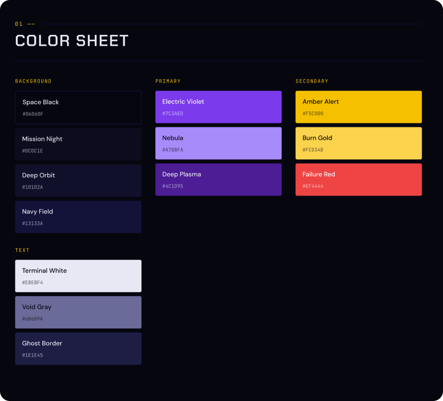
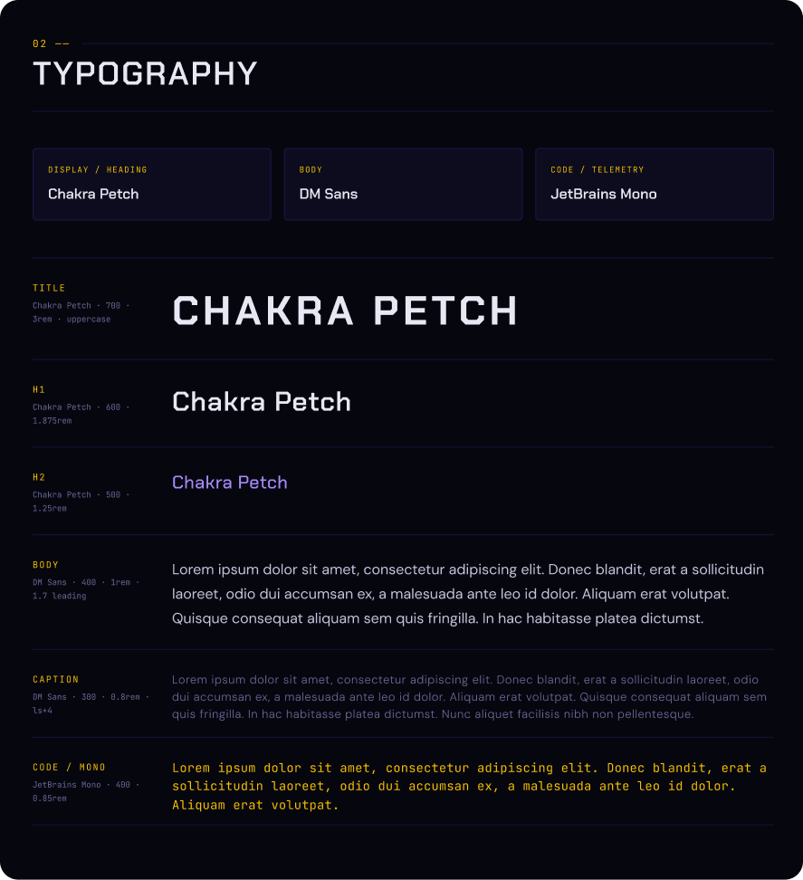
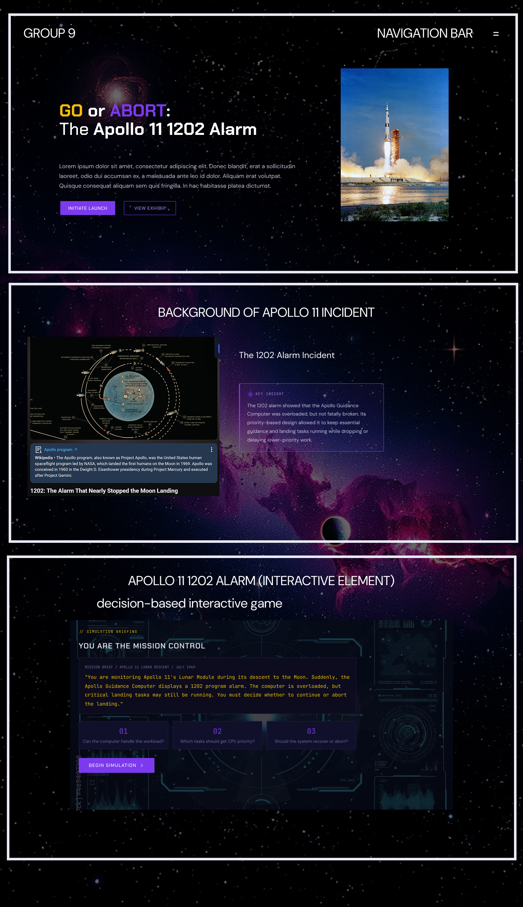

## Deployment Link

Live Website: [CSARCH2 G9 Virtual Exhibit](PASTE_DEPLOYMENT_LINK_HERE)

---

# MC02 Mid-Milestone Development Update

## Current Progress

The group has started converting the proposal into a working Astro-based virtual exhibit website. The site now uses a section-based structure with a homepage, navigation bar, shared layout, global styling, and reusable exhibit components.

Current website sections include:
- Hero / Landing Section
- Background Section
- Architecture Concept Section
- Timeline Section
- Interactive Simulation Section
- Lessons Learned Section
- References Section

---

## Hero & Background Progress

The Hero and Background Sections have been developed as Astro components:
`src/components/sections/Hero.astro`
`src/components/sections/Background.astro`

The sections currently include:
- A rocket launch auto-scrolling to the next section
- Navigation to jump directly to the interactive exhibit
- Interactive 3 slide carousel andabout the Apollo 11 mission, Lunar Module Eagle, and 1202 alarm
- Desktop and mobile responsive layout

The sections are designed to be visually appealing and introduce the user to the historical context of the Apollo 11 launch and the stakes involved so that the users are hooked before going into the technical aspects and interactive simulation of the event.	

## Architecture Concept Progress

The interactive architecture exhibit, **Apollo Guidance Computer Architecture**, has been developed as a React component:
`src/components/ArchitectureChip.jsx`

The exhibit currently includes:
- Interactive AGC chip visualization with clickable architecture nodes
- Processor workload explanation
- Task prioritization and preemptive scheduling
- Real-time execution and WAITLIST overview
- 1201/1202 program alarm explanations
- Error recovery through the BAILOUT1 restart routine
- Desktop and mobile responsive layout

The exhibit is designed to encourage exploration rather than passive reading. Selecting different nodes updates the information panel, allowing users to learn how the Apollo Guidance Computer's architecture enabled the Apollo 11 Lunar Module to continue operating despite limited hardware resources and processor overload.

## Timeline Progress
The "Problem Timeline" has been developed as an interactive React component. Instead of a standard vertical list, it uses a star-map-style UI (`ConstellationTimeline.jsx`).

Current features include:
- Clickable star nodes that trigger and permanently display event info cards
- Manual "zig-zag" layout positioning to prevent UI clutter and overlapping text
- Strict Z-index layering so interactive buttons always sit perfectly below/above readable text
- Horizontally scrollable container wrapped around a fixed-width timeline to maintain the layout's integrity on mobile devices>>>>>>> main

## Interactive Simulation Progress

The main interactive element, **Mission Control: Handle the 1202 Alarm**, has been developed as a React component:
`src/components/MissionControlSimulation.jsx`

The simulation currently includes:
- Retro terminal-style computer interface
- 1202 alarm scenario
- User decision prompts + task priority choices
- Computer load and risk level updates
- GO / ABORT decision points (multiple endings)
- Desktop and mobile responsive styling

The simulation is designed to be interactive rather than static. User decisions change the system state, computer load, risk level, final recommendation, and ending.

## Lessons Learned & References Progress
The Lessons Learned and References sections have been built as static Astro components and slot into the section-based homepage: 
`src/components/sections/LessonsLearned.astro`
`src/components/sections/References.astro`

The Lessons Learned section now presents the key takeaways from the Apollo 11 1202 alarm. The section currently includes:
- Five lessons covering task prioritization/scheduling, working within limited hardware, error handling and recovery, reliability over raw speed, and how system design shaped Mission Control's real-world decision
- Each lesson explicitly links the historical event to a computer architecture principle, reinforcing the exhibit's technical goal. 

For the  References section, it now provides an updated source list for the exhibit's historical and technical content. The section currently includes:
- A structured, auto-sorting reference list (alphabetical by author) with APA-style formatting and hanging indent
Numbered markers and clickable source links
- The section structure and styling are complete; the final reference entries are being gathered and will be populated before final submission.


---

## Aha Moments / Things Learned

Kimberly: While developing the simulation, we clarified that the Apollo 11 1202 alarm was not a total computer failure. It was an overload condition where the Apollo Guidance Computer had to keep critical landing tasks active while managing limited processing resources.

Denise: While researching about the Apollo Guidance Computer, one thing that surprised me was learning that its processor was built almost entirely from NOR gates. We also found it really cool that a computer with only 4 KB of RAM could successfully guide Apollo 11 to the Moon. It was astounding to see how the people involved worked with the hardware limitations of the 1960s and still made the most of the technology available to achieve something as big as the first crewed Moon landing.

Adolfo: I learned how a processor with extremely limited resources organizes and prioritizes work, how it handles operations under overload, and how the system recovers from an error condition instead of failing outright. 

MJ: Researching about the Apollo 11 1202 alarm made me realize the importance of having efficient design. The system successfully reported the problem and managed the data overload by stopping low priority tasks, ensuring that critical functions did not fail or lose processing time which allowed the first humans to successfully land on the Moon.

Tophi: I learned a lot about responsive design. Sometimes, we have to allow a horizontal scroll (`overflow-x: auto`) for a fixed-width container because it is a much more user-friendly solution on mobile than trying to force a difficult desktop layout to squish and shrink

## Challenges Encountered
Kimberly:
- Making the game logic and story game flow understandable for all 
- Balancing and making the simulation dynamic instead of slide-like
- Designing a retro terminal UI that works on both desktop and mobile

Denise:
- Creating an interactive computer-chip component with SVG with little experience with SVG
- Organizing computer chip and info panel layout and preventing them from overlapping
- CSS layout issues, particularly keeping div sizes from dynamically changing incorrectly

Adolfo:
- Formatting the references with proper APA-style hanging indents and links that don't overflow on mobile
- Keeping a large pinned moon graphic from bleeding into neighboring sections while it stayed fixed during scroll

MJ:
- Building the loop logic for the carousel slides so that they can infinitely move to the next or previous slide

Tophi:
- Trying to keep 6 timeline text cards open permanently 
- The text boxes were overlapping and the clickable stars were rendering on top of the text


---

## Next Steps
- Further improve the cohesiveness of the style and design across the sections
- Complete the remaining exhibit section content
- Improve section layouts and responsiveness
- Polish UI, animation, and cohesiveness of website
- Apply revisions from sir Rog's comments if there's any

## Section Progress Log

| Section                | Progress / Update                                                                                                                                                   | Member   |
| ---------------------- | ------------------------------------------------------------------------------------------------------------------------------------------------------------------- | -------- |
| Hero / Landing         | Developed as an Astro component featuring an auto-scrolling rocket launch and direct navigation to jump to the interactive exhibit.                                 | MJ       |
| Background             | Built as an Astro component with a responsive, 3-slide interactive carousel detailing Apollo 11, the LM Eagle, and the 1202 alarm.                                  | MJ       |
| Architecture Concept   | Implemented a React component with an interactive AGC chip visualization explaining processor workload, preemptive scheduling, and error recovery.                  | Denise   |
| Timeline               | Created a responsive, star-map-style React component with clickable nodes, manual zig-zag layout, strict z-index layering, and horizontal scrolling on mobile.      | Tophi    |
| Interactive Simulation | React-based decision simulation has been implemented with computer load updates, task-priority choices, GO / ABORT outcomes, and responsive retro terminal styling. | Kimberly |
| Lessons Learned        | The section is complete, presenting five takeaways that each tie the Apollo 11 1202 alarm to a specific computer architecture concept.                              | Adolfo   |
| References             | The section's structure, formatting, and styling are complete, with the final source entries still being gathered before submission.                                | Adolfo   |                         | Adolfo   |
---

### Artificial Intelligence Usage Disclosure

In the development of this project, we utilized generative AI tools (Google Gemini, OpenAI ChatGPT, and GitHub Copilot) to assist with technical implementation, content organization, and formatting. 

**How AI was used in this project:**
* Organizing our research process and drafting structural outlines for various exhibit sections.
* Condensing and summarizing the existing historical and technical content that our team researched and provided. 
* Transforming our raw, human-gathered data into structured formats (such as JSON arrays) for easier integration into the codebase.
* Troubleshooting layout issues in CSS, resolving TypeScript logic errors, and providing general workflow assistance.

All core data, historical facts, technical research, and initial content inputs were strictly sourced, provided, and verified by our group. The AI tools were used exclusively as assistive utilities to structure, summarize, and debug our work, not to generate the project's factual or historical information. All final outputs were reviewed and approved by the project contributors.


# CSARCH2 Virtual Exhibit Case Study Proposal

## Group Title: "GO or ABORT: The Apollo 11 1202 Alarm"

#### Category: Problem Solving Stories

#### Group Members

| Name                |
| ------------------- |
| Chong, Kimberly     |
| Hereula, Adolfo Jr. |
| Ho, Denise Liana    |
| Miranda, Isaiah     |
| Sarroza, Mikael     |

## Proposal Revisions  
  
Based on the feedback received, the proposal was revised with the following changes:  
  
- Changed the topic from Ariane 5 to **Apollo 11: The 1202 Alarm That Almost Stopped the Moon Landing** due to topic duplication.  
- Updated the exhibit concept to focus on the Apollo Guidance Computer, processor workload, task prioritization, real-time execution, and error handling.  
- Revised the interactive element into **“Mission Control: Handle the 1202 Alarm,”** an interactive story-based decision simulation with a CPU task-priority demonstration.  
- Updated the tech stack plan, proposed repository structure, file names, media resources, page sections, and references to match the Apollo 11 topic.  
- Included the style guide snapshot and tentative layout in the README.  
- Clarified that the interactive element will require user decisions and dynamic feedback, not a static slide-like presentation.

---

## Apollo 11: The 1202 Alarm That Almost Stopped the Moon Landing

During the Apollo 11 lunar descent, the Lunar Module’s guidance computer displayed program alarms that caused concern because the mission was already in a critical landing phase. Instead of treating the alarm as a complete system failure, Mission Control had to quickly determine whether the computer was still capable of handling the most important landing tasks.

The exhibit will focus on the computer architecture issue behind the event: how a computer with limited processing resources manages multiple tasks, how priority-based execution helps critical operations continue, and why error handling matters in real-time systems. 

The exhibit will guide visitors through the story using a museum-style layout with sections such as:

1. **Lunar Descent: Introduction to the Problem**
	- What was Apollo 11?
	- What was the Lunar Module “Eagle” trying to do?
	- What happened during the landing descent?
	- Why did the 1202 alarm create concern in Mission Control?

2. **The Computer Behind the Landing**
	- What was the Apollo Guidance Computer?
	- What tasks did it handle during the lunar descent?
	- Why were limited processing resources important?
	- How does a computer decide which tasks should run first?

3. **The Hidden Overload**
	- The computer received more workload than expected.
	- The 1201 and 1202 program alarms appeared during descent.
	- The issue became critical because it happened while the Lunar Module was landing.
	- The computer needed to keep essential guidance tasks running despite the overload.

4. **The Priority Decision**
	- The computer prioritized critical landing and navigation tasks.
	- Lower-priority tasks could be delayed or ignored.
	- Mission Control had to decide whether the alarm required an abort or whether the mission could continue.
	- This moment became the central problem-solving point of the story.

5. **Mission Response**
	- Mission Control interpreted the alarm and gave the mission a “GO.”
	- The Lunar Module continued its descent.
	- The computer’s design helped prevent total failure by preserving essential guidance functions.
	- Apollo 11 successfully landed on the Moon.

6. **Legacy and Lessons Learned**
	- Real-time systems need task prioritization.
    - Limited computer resources can still succeed with good system design.
    - Error handling and recovery are important in mission-critical systems.
    - Computer architecture is not only about speed, but also reliability, scheduling, and fault recovery.
    - The event shows how computer system design can directly affect real-world decision-making.

---

## Objectives of the Exhibit

The proposed virtual exhibit aims to:

- Explain the Apollo 11 1202 alarm and why it became a critical moment during the Moon landing.
- Help visitors understand the concepts of processor workload, task prioritization, real-time execution, and error handling.
- Demonstrate how limited computing resources can still support mission-critical operations when the system is designed to prioritize essential tasks.
- Present the historical and technical significance of the Apollo Guidance Computer and its role in the success of Apollo 11.
- Show how computer architecture concepts are applied in real-world high-pressure systems.

---

## Proposed Interactive Element

**Interactive Element Title:** 
Mission Control: Handle the 1202 Alarm

**Type of Interaction:**
Interactive Story-Based Decision Simulation & CPU Task-Priority Demonstration

**Description:**
The exhibit will include an interactive story-based simulation where visitors assume the role of a Mission Control engineer during the Apollo 11 lunar descent. Visitors will be presented with a simplified mission status display showing computer load, active tasks, and program alarm warnings. As the 1202 alarm appears, users must decide whether to continue or abort the landing based on the status of the computer and the priority of its tasks.

The simulation will also include a simplified CPU task-priority demonstration. Visitors will see different tasks competing for limited processing resources, such as landing guidance, navigation updates, attitude control, display updates, and extra radar-related data. They must choose which tasks should be prioritized. If visitors prioritize critical tasks, the simulation will show that the mission can continue. If they prioritize lower-priority tasks, the simulation will show worsening overload and explain why poor prioritization can endanger a real-time system.

This component will not function as a static slide presentation because users will click decision buttons, change the mission status, choose which tasks receive priority, and receive different feedback depending on their choices.

**Purpose:**
This interactive component will help users understand processor workload, task scheduling, priority-based execution, and error handling by allowing them to actively explore how a computer system can continue operating during overload conditions. Instead of only reading about the Apollo 11 alarm, visitors will experience the decision-making pressure of determining whether a computer alarm means “GO” or “ABORT.”

**Possible User Flow:**
1. User enters the exhibit page.
2. User reads a short introduction to Apollo 11 and the lunar descent.
3. User reaches the interactive simulation and sees a mission status panel.
4. A 1202 program alarm appears.
5. User chooses whether to continue or abort the landing.
6. User interacts with a simplified task-priority system by choosing which computer tasks should be prioritized.
7. The component gives visual feedback explaining whether the chosen decision helps the mission continue or worsens the overload.
8. User proceeds to the mission response, impact, and lessons learned sections.

---

## Tech Stack Plan

| Requirement         | Planned Implementation                                                                                                                                     |
| ------------------- | ---------------------------------------------------------------------------------------------------------------------------------------------------------- |
| Framework           | Astro 6                                                                                                                                                    |
| Runtime             | Node.js 26                                                                                                                                                 |
| Content Format      | MDX file                                                                                                                                                   |
| Components          | React JSX components and Astro components                                                                                                                  |
| Styling             | CSS + template-based styling of the museum exhibit                                                                                                         |
| Repository          | GitHub Repository                                                                                                                                          |
| Main Exhibit Page   | `apollo-11-1202-alarm.mdx`                                                                                                                                 |
| Interactive Element | React JSX Component                                                                                                                                        |
| Media Resources     | Apollo 11 images, lunar module visuals, guidance computer diagrams, alarm screen visuals, timeline assets, and mission control-inspired graphics if needed |
| Responsiveness      | Designed for desktop and mobile viewing                                                                                                                    |
| Documentation       | Google Docs and README file will be maintained in GitHub                                                                                                   |

---

## Proposed Repository Structure

```txt
CSARCH2-G9-Exhibit/
├── astro.config.mjs 
├── package.json 
├── package-lock.json 
├── tsconfig.json 
├── README.md 
├── public 
│ ├── favicon.ico 
│ └── favicon.svg 
└── src 
	├── assets 
	│ ├── apollo11-lunar-module.svg 
	│ ├── agc-diagram.svg 
	│ ├── alarm-1202-screen.svg 
	│ ├── mission-control-bg.svg 
	│ └── timeline-assets 
	│ ├── lunar-descent.svg 
	│ ├── program-alarm.svg 
	│ ├── task-priority.svg 
	│ └── moon-landing.svg 
	├── components 
	│ ├── MissionControlSimulation.jsx 
	│ ├── TaskPrioritySimulator.jsx 
	│ ├── DecisionCard.jsx 
	│ ├── AlarmTimeline.astro 
	│ ├── InfoCard.astro 
	│ └── Welcome.astro 
	├── layouts 
	│ ├── ExhibitLayout.astro 
	│ └── Layout.astro 
	└── pages 
		├── index.astro 
		└── apollo-11-1202-alarm.mdx
```


---

## Proposed Page Sections

The exhibit page may contain the following sections:

1. **Hero Section**
	- Exhibit title
	- Short subtitle
	- Main Apollo 11 / lunar descent visual

2. **Background Section**
	- Historical background of Apollo 11
	- Introduction to the Lunar Module and Apollo Guidance Computer

3. **Problem Section**
	- Explanation of the 1201/1202 program alarms
	- Explanation of computer overload and limited processing resources

4. **Architecture Concept Section**
	- Processor workload
	- Task prioritization
	- Real-time execution
	- Error handling and recovery

5. **Interactive Section**
	- “Mission Control: Handle the 1202 Alarm” simulation
   - CPU task-priority demonstration

6. **Mission Response Section**
	- How Mission Control responded
	- Why the landing was allowed to continue

7. Impact Section
	- Effects on computing, aerospace systems, and real-time system design

8. **Lesson Learned Section**
	- Key takeaways for computer architecture
	- Importance of reliability, scheduling, prioritization, and recovery

9. **References Section**
	- List of sources used

---

## Mobile-Responsive Layout Plan

The exhibit will be designed to be readable and accessible on both desktop and mobile devices.

**Desktop Layout:**
- Wider content sections
- Side-by-side visuals and explanations
- Mission status panel displayed beside the explanation when possible
- Interactive component displayed with full width or card layout

**Mobile Layout:**
- Single-column layout
- Larger spacing between sections
- Buttons and interactive elements sized for touch input
- Images and diagrams scaled to fit smaller screens
- Mission status and task-priority cards stacked vertically for readability

---

## Tentative Style Guide Snapshot

**Visual Theme:** Galaxy aesthetic with cosmic elements such as stars, planets, the Moon, Apollo 11, the Lunar Module, and Mission Control-inspired visuals. See Figma for working style guide file [here](https://www.figma.com/design/8mziXVxXo5SOnHLOq4FTQs/CSARCH2_Style-Guide-Snapshot?node-id=0-1&t=oGs4HKj2BUpslrLG-1).

**Color Palette:**



- Background (dark blue)
   -  `#06060F` (main)
   -  `#0B0C1E`
   -  `#18102A`
   -  `#13133A`

- Primary (purple)
   - `#7C5AED` (main)
   - `#A78BFA`
   - `#4C1D95`

- Secondary & Accents (yellow)
   - `#F5C800` (main)
   - `#FC0340`
   - `#FE4444`

- Text (black and white)
   - `#EBE8F4` (for dark background)
   - `#86889A`
   - `#1E1E45` (for light background)

**Typography:**




- Title or Headings: Chakra Petch 
- Body Text: DM Sans
- Code / Mono: JetBrains Mono

**Design Elements:**
- Video embed or visual reference of the Apollo 11 lunar landing / 1202 alarm incident
- Images of Apollo 11, the Lunar Module, the Apollo Guidance Computer, or Mission Control
- Buttons
- Info cards or callout boxes
- Timeline of events diagram
- Interactive simulation with decision buttons

**Tentative Layout:**



---

## References
[1] P. Adler, “Apollo 11 Lunar Surface Journal: Program Alarms.” [Online]. Available: https://www.nasa.gov/wp-content/uploads/static/history//alsj/a11/a11.1201-pa.html

[2] C. Averill, “A Brief Analysis of the Apollo Guidance Computer.” [Online]. Available: https://arxiv.org/pdf/2201.08230

[3] GeeksforGeeks, “Preemptive Priority CPU Scheduling Algorithm.” [Online]. Available: https://www.geeksforgeeks.org/operating-systems/preemptive-priority-cpu-scheduling-algortithm/

[4] J. Kutner, “We're Go On That Alarm: Inside the Apollo Operating System.” [Online]. Available: https://medium.com/softwares-giant-leap/were-go-on-that-alarm-inside-the-apollo-operating-system-8d753e7a1e17

[5] M. Mattioli, “Apollo Guidance Computer,” IEEE Micro, vol. 41, no. 6, 2021. [Online]. Available: https://www.computer.org/csdl/magazine/mi/2021/06/09623432/1yJTxgRWQgg

[6] MIT Instrumentation Laboratory, “Apollo Guidance Computer Documentation.” [Online]. Available: https://www.ibiblio.org/apollo/

[7] NASA, “Apollo 11 Mission Overview.” [Online]. Available: https://www.nasa.gov/mission/apollo-11/

[8] NASA, “The Apollo Lunar Surface Journal and Apollo Flight Journal.” [Online]. Available: https://www.hq.nasa.gov/alsj/

[9] NASA History Division, “Apollo 11 Lunar Surface Journal.” [Online]. Available: https://history.nasa.gov/alsj/a11/a11.html

[10] NASA Science, “Margaret Hamilton.” [Online]. Available: https://science.nasa.gov/people/margaret-hamilton/

[11] Royal Museums Greenwich, “Apollo 11 Moon landing: minute by minute.” [Online]. Available: https://www.rmg.co.uk/stories/topics/apollo-11-moon-landing-minute-minute

[12] K. Shirriff, “A Computer Built from NOR Gates: Inside the Apollo Guidance Computer.” [Online]. Available: https://www.righto.com/2019/09/

[13] Virtual AGC, “Luminary099: Apollo Lunar Module Guidance Computer Software.” [Online]. Available: https://github.com/virtualagc/virtualagc/tree/master/Luminary099